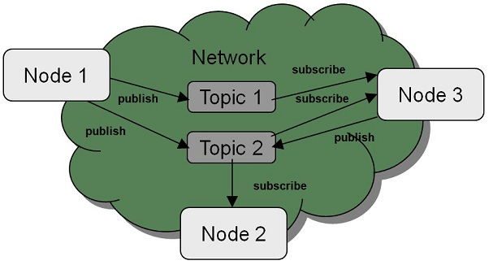
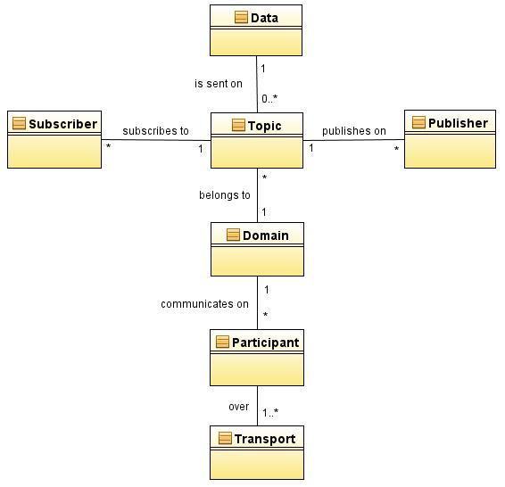
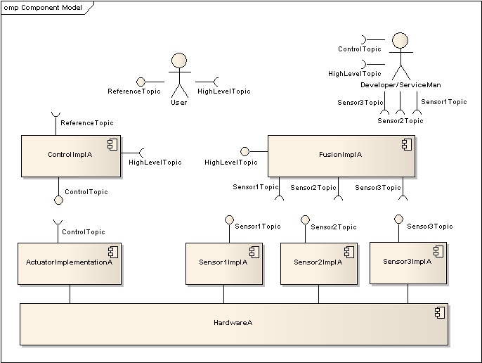

# Introduction #

OPS primarily targets distributed real-time and embedded (DRE) systems and distributed control systems (DCS).

OPS aims to offer asynchronous, efficient and type secure publish-subscribe communication between processes running on multiple platforms written in multiple programming languages.

The communication model of OPS is a typed topic publish-subscribe model. That means that processes that take part in the OPS communication can act as publishers or subscribers to different topics. Data published on a certain topic will be delivered to all subscribers to that topic in a way that hides the publishers from the subscribers and vice versa. By ensuring this anonymity the middleware allows for low coupling between different system participants which enables software reuse, modularity and redundancy among other desirable properties.

As mentioned above, OPS offers typed topics, which in addition to connecting publishers and subscribers also dictates the format of the data that is sent between them. The messages sent in OPS are Data classes that are defined by the system developers in a data definition language called OPS IDL. These data classes may be complex constructs, with inheritance, dynamic arrays, strings, classes of classes and arrays of classes. These Data classes are used to auto generate source code, for different target programming languages, that allows for communicating this data in a simple and secure way. The complexity of serializing and deserializing these classes and to be able to send them across the network is completely hidden from the participants, and the classes can be used in an object oriented and type safe way in the application layer of the participants.

Presently OPS is available in Java (Windows, Linux, Unix, Mac), C++ (Windows, Linux), C# (Windows) and Delphi (Object Pascal, Windows) programming languages. Experimental support exist for Ada (Windows) and Python 2.7. OPS can also be used under Matlab through the Java Matlab bridge available with Matlab.

## Basic Principles ##

  * Participants (i.e. applications residing in computer nodes) publish and subscribe on Typed topics
  * Decentralized architecture - there is no central service, each Participant carry enough of the middleware to "participate", i.e. communicate with each other.
  * Communication between publishers and subscribers is asynchronous and anonymous.
  * Networking and protocol complexity is hidden from application developers.

# Domain Model #
## Important concepts ##
  * **Topic** – A topic is a user defined string/name that serves as the association between Publishers and Subscribers.

  * **Publisher** – a Publisher writes data on a certain Topic.

  * **Subscriber** – a Subscriber subscribes to a Topic and receives data when a publisher on the same Topic writes data.

  * **Participant** – a Participant is an application/program that uses the OPS by having subscribers and/or publishers.

  * **Domain** – Participants that can connect to each other through publishers and subscribers belong to the same Domain. A Domain is defined by a multicast ip address (e.g. 235.35.35.1). By using different Domains two instances of a system can run alongside each other without interfering.

  * **IDL** – Interface Definition Language (IDL) is the language used to define data classes that can be communicated by publishers and subscribers. IDL is a meta language which is compiled, or translated, into various target programming languages (e.g. Java, C++, C# and Ada).

  * **Data classes** – Data classes is what is communicated between publishers and subscribers. Notice the difference between Data classes and Topics. Each Topic can have only one Data class associated with it, but a Data class can be used by many Topics.

  * **Transport** is the communication implementation that sends data as chunks of bytes over a IP network or other communication infrastructure. Examples of Transports include Multicast Transport or a TCP Transport.

## UML ##
The UML diagram below gives a graphical representation of the domain model and should be read as:

_Data_ is sent on _Topics_. _Publishers_ publishes _Data_ on _Topics_. _Subscribers_ subscribes to _Topics_. _Topics_ belong to _Domains_. A _Participant_ participates in _Domains_ by communicating over _Transports_.

# OPS Offers #

  * **Information availability** - high level data available across the network.

  * **Low coupling** - hides the implementations of publishers and subscribers from each other and does not introduce any synchronous dependencies between them.

  * **Efficient dissemination of high level data** - High performance communication of data with low latency and high throughput.

  * **Software reuse** - Makes it easy to build pre-compiled deployable software components with well defined interfaces without having linking dependencies between components.

  * **Task isolation** - Facilitates isolation of e.g. time critical tasks through asynchronous communication and platform and language heterogeneity.

  * **Open architecture** - Make your interfaces available to anyone without letting them into your code.

  * **Well defined interfaces** – data/hardware abstractions

  * **Language and platform heterogeneity** - Create distributed systems that span across various operating systems and programming languages using the ones best suited for your particular problem.

  * **Different hardware configurations → same software** - Make your software components independent of where they, and their dependencies, are physically running.

  * **Redundancy support** - Makes redundancy simple through use of parallel publishers of same data.

# Who should use it? #

As stated earlier, OPS primarily targets distributed real-time and embedded (DRE) systems and distributed control systems (DCS).

The following UML diagram shows a typical usage in a DCS. Note the important features OPS provide in the fictive system below: Information availability, Low coupling, Software reuse, Well defined interfaces, Efficient dissemination of high level data, Different hardware configurations → same software.

The components in the diagram are independent executables running on any number of machines connected to the same embedded network.

(Antennas with balls (--O) indicates publishing and antennas with arcs (--C) indicates subscribing)

# Who are Using It ? #

  * Information is being collected about users to present them here.
