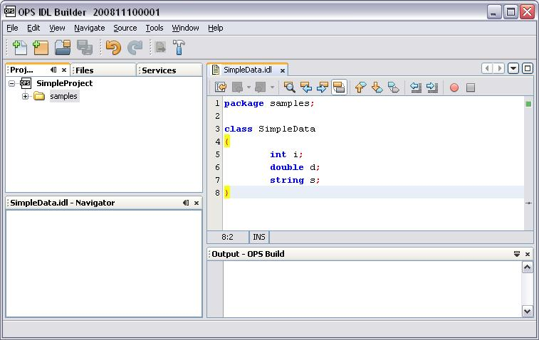

[Examples](SimpleCpp.md) [BuildInstructions](BuildInstructions.md)

---

# OPS IDL Builder #
Learn more about the OPS IDL language [here](IDLLanguage.md).

To edit IDL files and to compile these files into target languages, OPS comes with a tool called **OPS IDL Builder**. The **OPS IDL Builder** can be seen as an IDE for OPS projects.

Prerequisites for compiling IDL files with the tool **OPS IDL Builder** is to define the  
environment symbol **OPS_OPSC_PATH** with the path to the **opsc.bat** file, e.g.:
```
OPS_OPSC_PATH=D:\OPS\OPS4\Tools\opsc
```

The OPS IDL Builder looks as follows, with some sample code open in a sample project:



With the OPS IDL Compiler you create projects containing possibly multiple IDL files with all the different data types you use in your project. To compile the IDL files press the 'hammer'-button.

Compiled to C++, this is what would be generated from the SimpleData data type above:

```
//Auto generated OPS-code. DO NOT MODIFY!
#ifndef samples_SimpleData_h
#define samples_SimpleData_h

#include "OPSObject.h"
#include "ArchiverInOut.h"
#include <string>
#include <vector>

namespace samples {

class SimpleData :
	public ops::OPSObject
{
public:

    int i;
    double d;
    std::string s;

    SimpleData() : ops::OPSObject(),
        i(0),
        d(0)
    {
        OPSObject::appendType(std::string("samples.SimpleData"));
    }

    ///This method acceptes an ops::ArchiverInOut visitor which will serialize or deserialize an
    ///instance of this class to a format dictated by the implementation of the ArchiverInout.
    void serialize(ops::ArchiverInOut* archive)
    {
		ops::OPSObject::serialize(archive);
		archive->inout(std::string("i"), i);
		archive->inout(std::string("d"), d);
		archive->inout(std::string("s"), s);
    }

    ///Destructor: Note that all aggregated data and vectors are completely deleted.
    virtual ~SimpleData(void)
    {
    }
};

}

#endif
```

The IDL Compiler is also where you define your topics on which you will publish and subscribe to in your applications. This is done by creating a XML configuration file that looks something like this:

```
<root>
    <ops_config type = "DefaultOPSConfigImpl">
        <domains>
            <!-- Define a domain called FooDomain.-->
            <element type = "Domain">
                <domainID>SampleDomain</domainID>
                <domainAddress>234.5.6.8</domainAddress>
                <topics>
                    <!-- Define a Topic called SimpleTopic. -->
                    <element type = "Topic">
                        <name>SimpleTopic</name>
                        <port>8888</port>
                        <dataType>samples.SimpleData</dataType>
                    </element>
                </topics>
            </element>
        </domains>
    </ops_config>
</root>

```


See what the OPS IDL Builder looks like and how to create a new project here:

<a href='http://www.youtube.com/watch?feature=player_embedded&v=UsdjMwTUV3s' target='_blank'></a>
