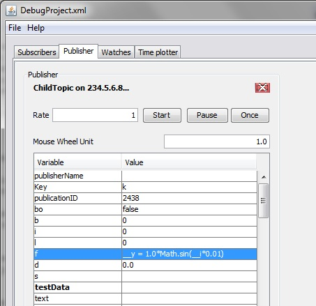

# Debugging your OPS Applications with OPS Debugger #

OPS comes with a tool called OPS Debugger which can be handy to spy into traffic sent on any topic, or to publish samples to see how the system will react.

This is how you use the OPS Debugger (See also [Installation](Installation.md))

Open the OPS Debugger (double click OPS\_DIR\Tools\OPS Debugger\OPSDebugger2.jar)
> Once open, click "File->Open Project..." and browse to OPS\_DIR\Examples\TestAll\DebugProject.xml
> To the right you can now see the a drop down list with topics (ChildTopic in this case).
> Drag the Topic from the tree view on Subscribers or Publishers tab to subscribe to or publish on the topic.
> Watch this video to see how to get some action:

> 

To be able to debug your own OPS IDL Builder projects (i.e. Data classes and Topics) right click your project in the OPS IDL Builder and select "Project Properties...", make sure you have Generate Debug Project File checked and write in the name of the domain you want to debug and the path to your ops\_config.xml. Click OK and rebuild your project. You should now have a file "DebugProject.xml" directly under your project folder which you can use with the OPS Debugger (See video above).

### Tips, Tricks and known Issues ###

The OPS Debugger can be useful but it also has some shortcomings. It may be heavy on your CPU depending on your Java runtime and the rate at which you publish data. If you experience such problems, you might want to use the Time Based Filter to make it repaint less often. And if you have large arrays with chunk data that your not interested in, you can check suppress arrays to improve performance.

The Plotter and Watches tabs are really experimental and are known to not work well on Vista and Windows 7 operating systems. Use them if you like, but you might run in to problems.

When publishing data from the Publishers tab there are a few nice features to know about.

To change any value, you can double click the value of a field and write in whatever you want, just make sure it can be interpreted as the type of the field.

More than typing in values, you can also use the scroll wheel to increase or decrease numerics or to toggle booleans. Also, right clicking a numeric sets it 0 and right clicking a boolean toggles it.

Yet another way to manipulate what is sent with the debugger is to use Java script expressions like y = f(i) where y will be the output for a field value and i is the publicationId.

For example to have a publisher publish a double value so that it oscillates around 0 you could type y = 1.0\*Math.sin(i\*0.01) in a cell and hit enter.

